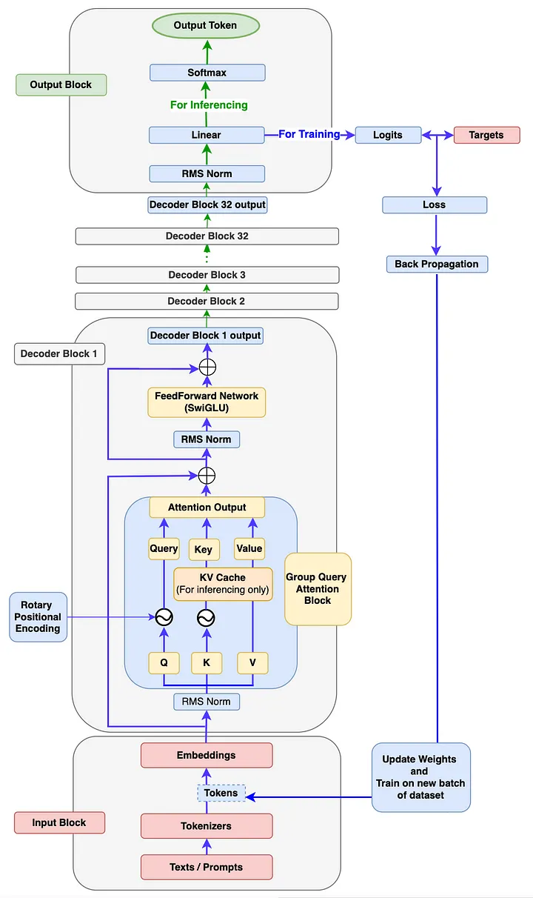
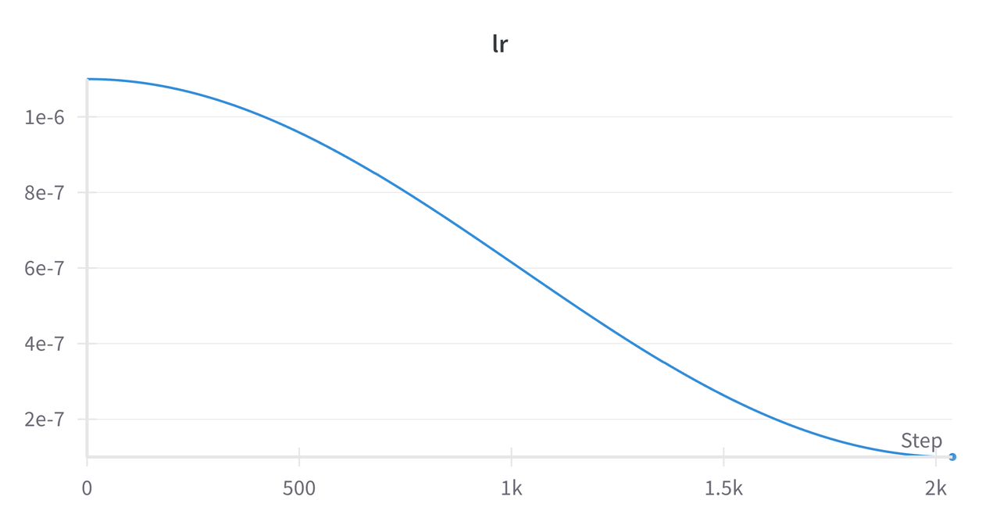

## 项目简介

本项目旨在从零开始构建一个拥有千万参数的大规模预 训练模型，涵盖预训练（Pretrain）、有监督微调（SFT）和R1蒸馏微调三个阶段。通过创新的模型结构和优化的训练流程，成功打造了一个高效且具备思维链能力的问答系统。项目中，我们从基础架构、分词器设计到具体训练的每个环节进行了精细化实现，最终获得了具备流畅问答与推理能力的大模型，能够有效完成多任务学习，适用于复杂的AI应用场景。




主要工作：
1. 模型架构搭建： 以LLaMA3模型架构为范本，结合RMSNorm、分组注意力机制GQA、SwiGLU激活层和RoPE位置编
码等技术来从零构造模型，提升了模型在长文本处理与多任务学习中的性能。
2. Tokenizer构建： 从零设计基于 BBPE 编码的分词器，以6400轻量级词表大小获得良好的中文支持能力，在保证分词器
压缩率和解码能力的条件下，为模型的多语言处理能力奠定了基础。
3. 预训练： 从零构建完整的训练流程，包括损失计算、前向传播及梯度更新过程。并结合自动混合精度训练技术，提升了
计算效率，确保了大规模数据集上的高效预训练。
4. 有监督微调（SFT）：通过格式化和优化开源SFT数据集，增强了模型的指令理解与任务执行能力。定制化设计了SFT过
程中指令部分的loss掩码，提升了模型对指令的执行效率。
5. R1推理蒸馏： 采用Deepseek-R1问答数据集对大模型进行进一步优化，复用SFT部分的训练代码进行黑盒蒸馏，并根
据蒸馏结果精细调整损失权重，以优化模型的推理和思维能力。

## 项目细节：

### 分词器训练：
  - python train_tokenizer.py 开始运行分词器训练

训tokenizer是一个CPU/内存密集型任务，不需要显存，对CPU和内存要求比较高

阿里云服务器A10版内存不够，只有32G，如果要跑分词器，需要内存>=96G的实例

最终选择使用用AutoDL平台，120G内存，4090 24G显存


内存峰值89G左右

### 预训练：
- pretrain.py

AutoDL平台实验记录：

- 环境：
  - python版本：3.12
  - torch版本：2.5.1+cu124
  - transformers版本：4.49.0
4090/24G，跑2个epoch，每个epoch约80min，总时长<3h


  - 小实验：上述都刚刚跑到总step数的10%左右就停掉了
    - 深紫色：bs=80，梯度累积=2，wramup=False，lr=5e-4
    - 橘黄色：bs=80，梯度累积=4，warmup=True（ratio=0.03），lr=5e-4
    - 青色：bs=80，梯度累积=4，warmup=True（ratio=0.1），lr=5e-4
    - 浅紫色：bs=80，梯度累积=4，warmup=True（ratio=0.1），lr=5e-5


紫色看起来收敛最快，但震荡也更明显些，到2500step后前三条曲线收敛情况就比较相似了
（这里的step应该按*10来换算，wandb 的显示bug）

  - 蓝色：bs=80，梯度累积=4
  - 绿色：bs=84，梯度累积=8


等效batch_size变大了，学习率不变，收敛速度会变缓，更容易陷入局部最优，实践上应同样增大学习率

- 绿色：学习率0.004
- 橙色：学习率0.001


从收敛情况来看，等效batch_size=160(batch_size * gradient_accumlation)左右是个不错的实践.
- 最终选择：epochs=2 ,batch_size=84, 梯度累积=2 ，lr=5e-4, warmup=None
  - 显存峰值：23G/24G（利用率还是比较高的）


执行推理过程

可以看到pretrain模型本身是不具备问答能力的，只是在学词语接龙

### SFT：
SFT的代码大量继承了Pretrain的代码，仅仅数据加载做了改变，SFT类数据集定义参考dataset.py文件

- SFT数据
  - sft512.jsonl(7.1G)，由匠数科技的SFT数据(24G)清洗而成，筛选出了总长度小于512的部分。
  - sft_mini512.jsonl(1.23G)，上一部分数据的缩小版
  - 数据格式为：

```
 {
    "conversations": [
        {"role": "user", "content": "你是谁"},
        {"role": "assistant", "content": "我是SpongeBob"},
        {"role": "user", "content": "再见"},
        {"role": "assistant", "content": "再见！"}
    ]
}
```

实验记录
- 平台:Autodl 4090/24G
- 环境：
  - python版本：3.12
  - torch版本：2.5.1+cu124
  - transformers版本：4.49.0
  
- 使用sft_512.jsonl数据跑，单个epoch时间约为6.7h，epochs=1 ,batch_size=84, 梯度累积=2 ，lr=5e-4, warmup=None


会发现这里震荡比较大，主要原因是数据质量问题，给模型整不会了。次要原因是等效batch_size偏小，可以适当增加梯度累积，减小学习率，以减小震荡幅度

- 使用sft_mini_512.jsonl数据跑，单个epoch时间约为80min，epochs=2 ,batch_size=84, 梯度累积=8 ，lr=5e-4, warmup=None


- 执行推理过程


模型长文能力训练
继承SFT训练代码，唯一不同是此次使用长度为512-1024的问答对进行训练，让模型在该区间内具备能力
- 数据
  - sft_1024.jsonl (5.2G)
- 相比于SFT.py文件更改如下：
  - max_seq_len参数需要修改为1024
  - data_path参数需要修改为sft_1024.jsonl
  - init_model函数中加载时，应该加载SFT.pth（即上一步的SFT模型）
  - train_epoch函数中的save部分，建议保存为SFT_long.pth以和SFT做对比
  - Wandb 的project可改可不改，看个人喜好
  - batch_size要改小，实测4090/24G，只能跑batch_size=28-30, 否则会报错Cuda OOM
  - 改小了batch_size,那accumulation_steps要改大，比如8，来维持等效batch_size

实验记录
使用sft_1024.jsonl 训练，开6卡A800(80G显存)训练，其实和4090一样，并行度高一些
- epochs=1,batch_size=100，lr=5e-5 ,梯度累积=1，max_seq_len=1024, warmup=None


- 在4090上单卡跑，用时约6-7h

推理
和SFT相同，将推理加载模型改为我们训好的SFT_long.pth即可

老版SFT推理结果


SFT_1024推理结果，回答会更全面些，虽然不可避免会有少许幻觉


### R1思维链蒸馏
这里我们采用黑盒蒸馏方法对拥有长文能力的model进行蒸馏，后面会对比长文能力的有无对蒸馏效果的影响。
- R1的输出格式一般采用在<think> 思考内容 </think> <answer> 回答</answer>的格式来产生慢思考过程。
- 结合开源社区的结论：R1的纯基于强化学习无法在<3b模型上复现，因此我们优先采用蒸馏方法。
- 蒸馏数据使用r1_1024.jsonl(360M)，格式和SFT数据相似：

```
{"conversations":
[{"role": "user",
 "content": "请帮我写一个古风诗句，表达一种淡淡的哀愁和思念。"}, 
 {"role": "assistant", 
"content": "<think>\n好吧，用户让我帮他写一个古风诗句，主题是淡淡的哀愁和思念。首先，我需要理解他的需求。他可能希望这句诗能传达一种难以言喻的悲伤，但又不失古风的意境，这可能用于文学创作或者表达情感。\n\n我应该考虑古风诗的结构和常用词汇。古风诗常常使用自然意象，比如山水、 Places、四季等，来营造氛围。哀愁和思念可能涉及离别、思念、痛苦等情感。\n\n接着，我需要选择合适的词语来表达这些情感。比如“无尽有”可以表达无法言喻的悲伤，“空字”作为思念的代名词，这样既简洁又富有情感。如果季节有变化，换个季节会更有变化。\n\n然后是描绘场景，比如“天涯冷月”强调southenly的寒冷，增添夜晚的氛围，增加诗意。再加“孤影凄凄照”来表达内心的思念，最后一句“苦耐心犹未去”直接点明哀愁。\n\n最后，检查句子的对仗和节奏，确保流畅自然，符合古风的韵律。这样组合起来，应该能够满足用户的需求。\n</think>\n
<answer>\n无尽有，空字，若无云处。天涯冷月，孤影凄凄照，苦耐心犹未去。\n</answer>"}]}
```

- 鉴于我们的tokenizer对<think></think>编码效率低，需要4个token，因此模型对学习这种范式会略显困难，为了优先学习这种范式，我们会手动加大这些token的损失惩罚。

蒸馏代码
- distill.py（和SFT唯一区别是修改了loss针对思维链token的损失惩罚）

实验记录
使用r1_1024.jsonl数据集进行训练，使用不同模型基座进行了两个版本的训练
- 使用SFT.pth作为基座训练（未经过1024数据训练）
  - 训练环境
    - python版本：3.12
    - torch版本：2.5.1+cu124
    - transformers版本：4.49.0
    - 单机1卡4090/24G
  - epochs=3，batch_size=30, lr=1e-6, 梯度累积=8，max_seq_len=1024, warmup=None

  

  
  
​
loss抖动比较大，推测loss突刺是因为模型没有在长文本上训练，但loss突刺处的数据是接近1024长度的长文本数据

- 使用SFT_1024.pth作为基座训练（经过1024数据训练后）
  - 训练环境
    - python版本：3.12
    - torch版本：2.5.1+cu124
    - transformers版本：4.49.0


可以看到loss直接降到1.4以下了，说明学的非常好


- 发现每个epoch结束的突刺（Loss Spike）比较严重，导致最终保存的模型很不稳定，推荐在1.5个epoch（修改一下保存的代码，比如特定步数后不覆盖之前的文件）处保存一次，效果应该会好很多！
  - 这里主要原因是训练数据的问题，在每个epoch结尾有脏数据（也不一定是客观上的脏数据，因为模型没有英文能力，如果最后部分数据有大量英文，那必然会让模型loss训飞），会导致模型训练不稳定。
  - 当然，突刺的剧烈也是因为batch_size小，学习率大导致的，推荐等效bs=600左右，学习率1e-6

推理
- 直接通过修改eval_model.py加载相应模型
- python eval_model.py --model_mode 2


distill_long.pth的推理结果，能在0.03B的模型上看到这个效果，已经完全超出预期😄
无论从格式还是内容上都能达到不错的效果